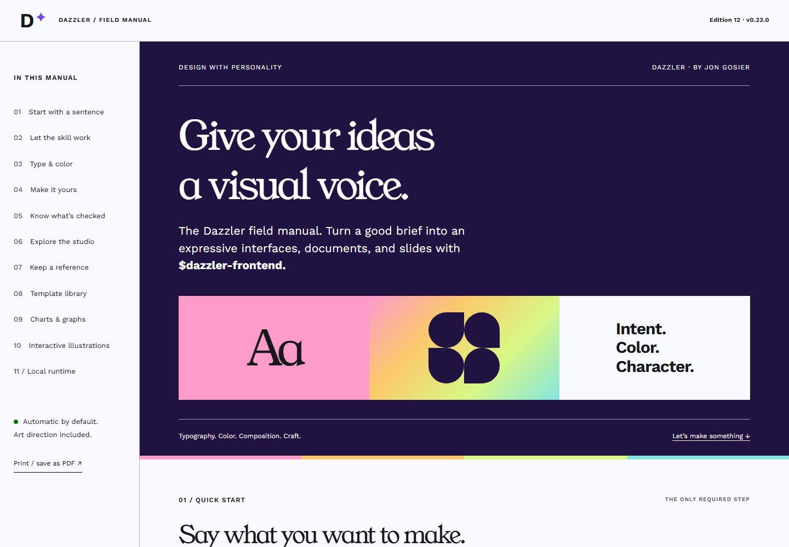
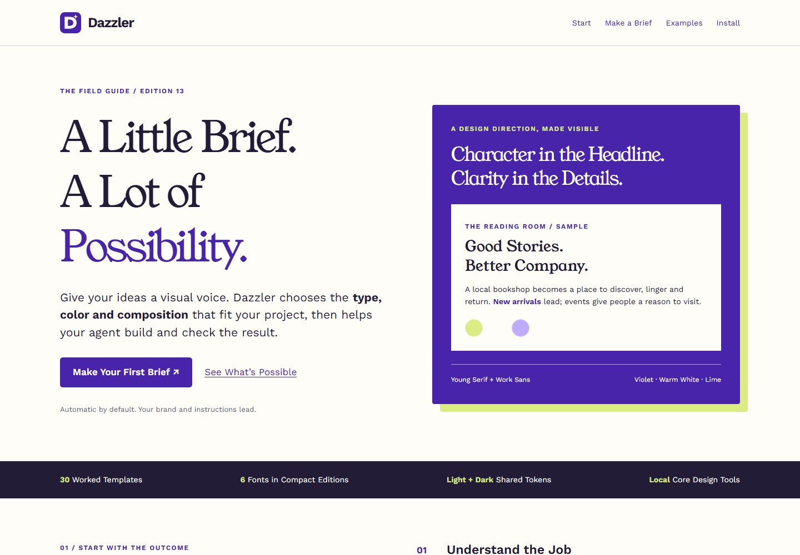

# 0.23.0: Field Guide and Issue Reconciliation

The field guide is rebuilt around a practical brief, an interactive prompt builder, a searchable gallery, verification guidance and host setup. It preserves the existing Young Serif / Work Sans identity. Core HTML, CSS and JavaScript total about 47 KB, down from a 674 KB HTML file with inline assets. Fonts and gallery images are separate resources; this is not a claim about total transfer size.

## Delivered Work

| Issue | Implementation | Evidence / boundary |
| --- | --- | --- |
| 34 | Repository discovery topics; canonical skill validation. | `gh skill publish skills --dry-run` passes with an advisory about absent tag-protection rules. External indexing is asynchronous. |
| 35 | Root Agent Plugins manifest plus Claude and Cursor overlays; retained Codex interface metadata. | Root passes the official schema; Claude plugin passes CLI 2.1.284 strict validation. Source installs intentionally use the larger catalog. |
| 36 | Required marketplace description in generator and checked-in manifest. | Claude 2.1.284 strict marketplace validation passes; the release archive stays version/hash pinned. |
| 38 | Prominent source install command, Node requirement, neutral telemetry choice and version drift guards. | Regression tests reject stale onboarding URLs/commands and every manifest version. Listing returned a soft 404, and the requested badge said resource not found; neither is presented as live. |
| 39 | Root Gemini extension manifest and a separate compact extension ZIP. | Gemini CLI 0.61.0 validates both root and extracted package. In a disposable profile under Node 22.16, local install, enabled skill discovery and uninstall complete successfully. Node 24 emits a libuv shutdown assertion after completing operations. No AI task, automatic update or curated-directory submission is claimed. |
| 19 | Grok Bot display-name/folded-description ZIP, host routing and manual installation guide. | Same compact budget, inventory, helper and cross-platform build checks. No authenticated Grok Bot install was available; manual indexing remains explicitly unverified. |
| 26 | Native SwiftUI, Compose and Flutter exports complete the existing shadcn/handoff/optional-comp work. | Three source snapshots, invalid-input checks and extracted-package export smoke tests. Native toolchains and live Figma were unavailable; files are integration proposals, not compiled apps. |
| 29 | Consolidated philosophy assessment and a twelve-rule enforcement map. | Seven public primary sources, explicit/inferred matrix, disagreements and existing 30-template audit. Paid books were not accessed. |

## Remaining External Evidence

| Issue | What is done | What remains |
| --- | --- | --- |
| 9 | Description, original positive/negative suite and honest observation harness. | A fresh diagnostic Codex turn attempted to read the skill, but host execution policy rejected it. No measured recall/precision or improvement claim follows from that probe. Run the original suite in a host that permits the skill read. |
| 13 | Compact Claude archive is approximately 11.3 MB compressed / 19.6 MB unpacked; 24 MB gates pass. | Claude website opened at sign-in. Hosted skill upload and invocation require an authenticated eligible account; local validation is not upload acceptance. |
| 20 | Managed five-host install/rollback, source install option, pinned Claude marketplace and Gemini extension. | Public skills.sh entry is not yet available. Host selection stays explicit to avoid unintended installs; Grok uses its documented manual box path. |
| 37 | Square SVG/512 PNG logo, composer icon, real guide before/after images and a 30-second guided walkthrough. | The GIF is a walkthrough, not a generation recording. Historical template comparisons are not same-prompt with/without-skill trials. Three controlled host comparisons and a genuine generation demo still need runnable host sessions. |

## Validation

Local checks: 76 Node tests; 54 Python tests (one actual symlink case skipped on Windows); source links and release versions; all ten ZIPs under compressed/unpacked gates; extracted helpers, inventories and installer lifecycle; official manifest validators; all 30 gallery destinations; guide fonts, axe scan, keyboard filter, copy denial, hostile prompt text, 390/768/1440px reflow and actual 200% body text scaling. All six printed pages were inspected after deliberate chapter pagination. These checks do not certify full accessibility.

The guide browser test now runs in CI. Existing Windows/Linux × Node 20/22 builds compare every archive hash, including Grok and Gemini extension archives. Release assets are published only after checking the commit's CI result and matching local hashes. The Windows offline kit includes the new manifests, assets, native tests and this report.

## Guide Comparison

| Previous guide | Rebuilt guide |
| --- | --- |
|  |  |

These are actual captures of two guide revisions, not an A/B model benchmark.

## Notes and Sources

- [Design philosophy assessment](DESIGN-PHILOSOPHY.md) and [Phase 6 template evidence](phase6/README.md).
- [Agent Plugins schema](https://agent-plugins.org/schemas/1.0.0/plugin.schema.json), [OpenAI plugin structure](https://developers.openai.com/plugins/build/plugins), [submission assets](https://developers.openai.com/plugins/deploy/submission-errors), [Cursor plugin reference](https://cursor.com/docs/reference/plugins), [Claude marketplace reference](https://code.claude.com/docs/en/plugin-marketplaces), [Gemini extension reference](https://geminicli.com/docs/extensions/reference/).
- [Dazzler issue tracker](https://github.com/jongos/Dazzler/issues). No third-party marketplace, awesome-list or directory submission was sent. Metadata makes the project eligible for discovery; it does not guarantee acceptance.
