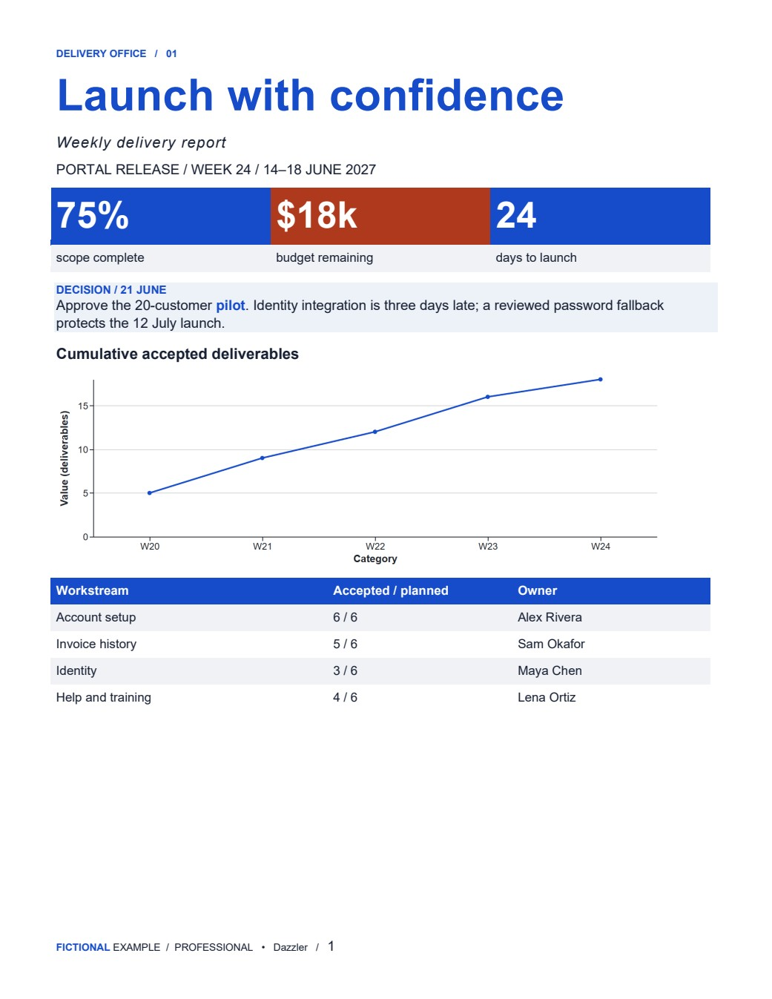
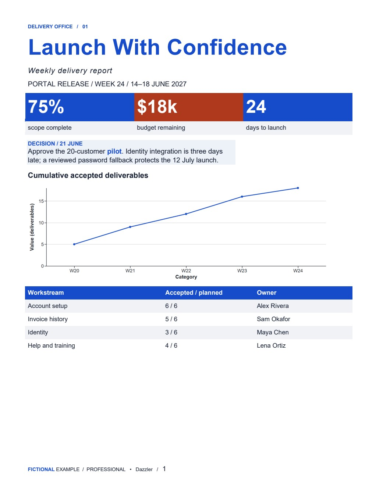
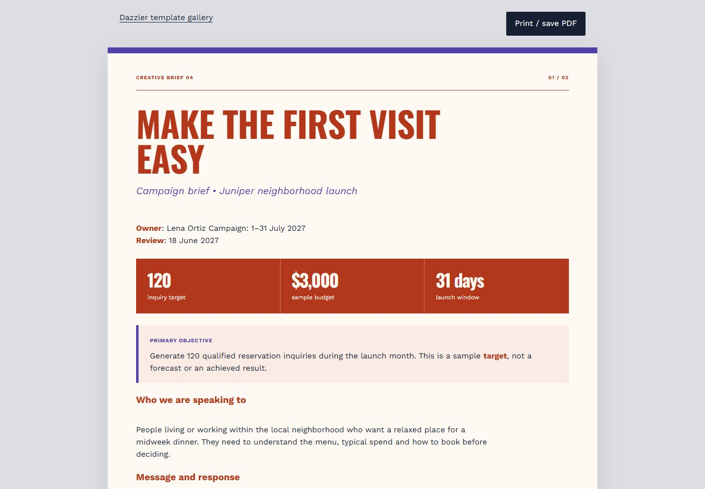
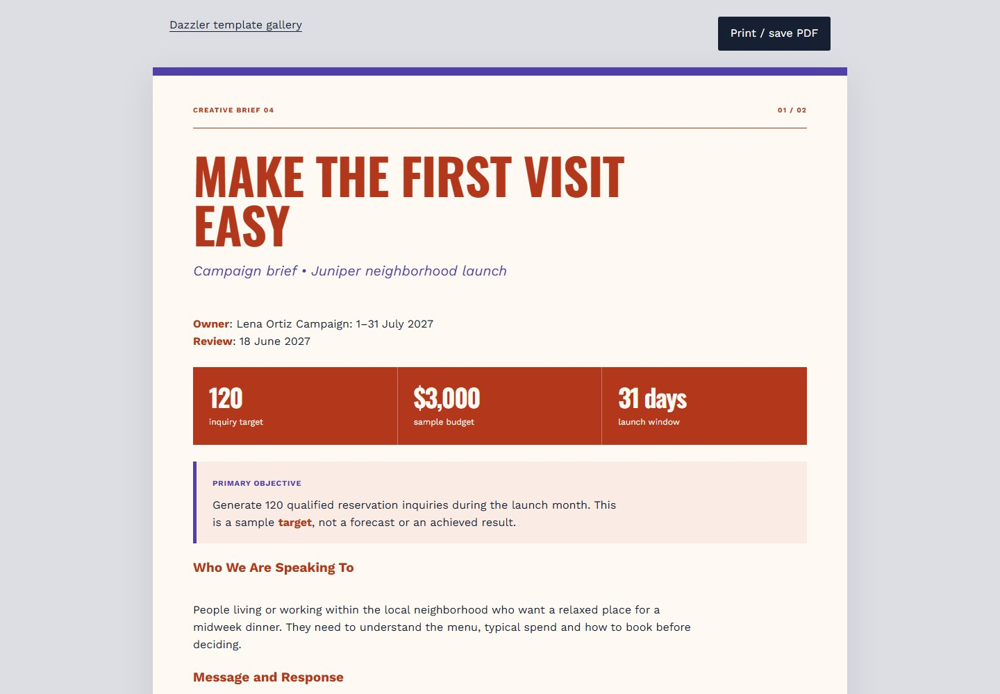
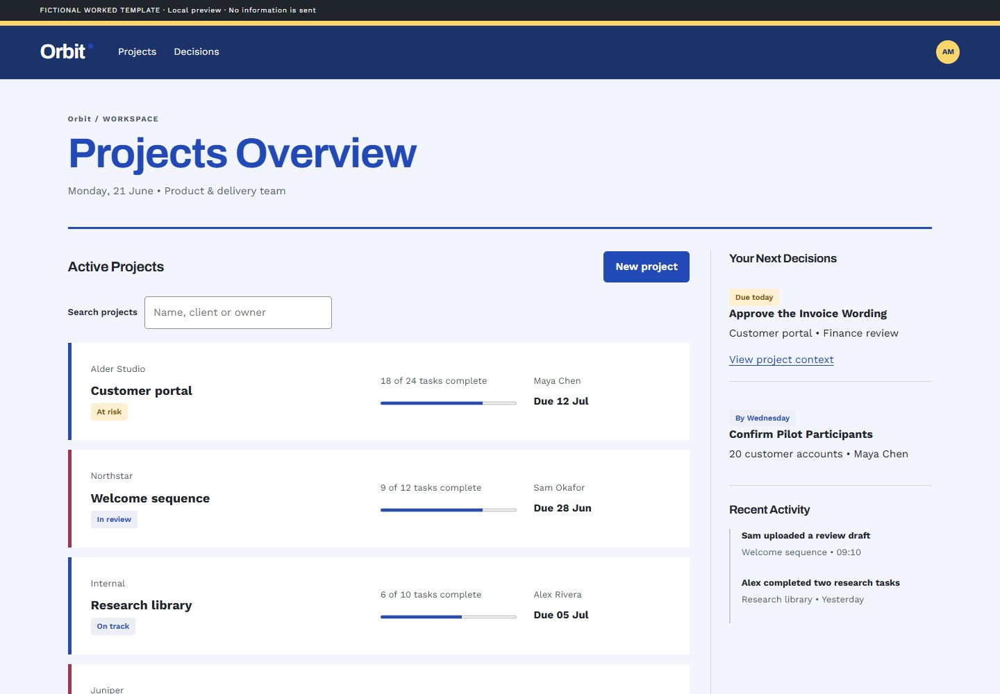

# Phase 6: Design Defaults and Issue Reconciliation

Phase 6 consolidates the shipped features and implements the actionable design-policy, heading, packaging and installer work. Existing saved schema-1/2 token output remains compatible; new projects use schema 3. No host integration is promoted from unverified to verified merely because its package builds.

## Reconciliation

| Issues | Disposition |
| --- | --- |
| 17, 18, 21, 23, 24, 25 | Delivered in Phases 3–4: fluid type, composition contracts, supported DESIGN.md interchange, refinement, controls and persistence. Retain regression coverage. |
| 22 | Contextual measured review is delivered. An AI-authorship detector is not a supported or defensible interpretation. |
| 27, 28 | Delivered in Phase 5: dated comparison, starter catalog and optional handoff variants. |
| 9 | Trigger harness delivered; real-host observations remain inconclusive or unmeasured. |
| 13 | Compact package is built and size-gated; real Claude upload remains unverified. |
| 19 | No authenticated Grok session was available. No Grok package or test result is claimed. |
| 20 | Managed installer and release-pinned marketplace delivered. Automatic host guessing is intentionally avoided; external indexing remains unverified. |
| 26 | Compatible shadcn fixture tested. Figma guidance and opt-in comps delivered; live Figma and native export remain unverified. |
| 29 | Twelve original principles, explicit enforcement mapping, source assessment, template reconciliation and review evidence. Source research is maintainer-only. |
| 30 | Automatic tone, 60ch measure, grid tokens, local licensed-font import, ratio-based AA/AAA checks and a danger foreground. Overrides and brand locks take precedence. |
| 31 | Protected English heading helper in Python/Node; saved casing policy; export/template integration and browser review candidates. |
| 32 | Claude plugin commands use the plugin namespace in entrypoint and starters. Standalone commands stay standalone; other host guides omit Claude-specific instructions. |
| 33 | Actionable unmanaged-install and missing-rollback messages; project backups self-ignore while preserving existing rules. Manual adoption is an explicit migration, never an invented ownership receipt. |

## Design Decisions

The 60ch maximum is a Dazzler house default, not a universal accessibility threshold. Character-relative widths vary with fonts; Word estimates require native page review. Expressive defaults serve creative work; high-stakes and administrative contexts select reserved treatment. An existing design record takes precedence over context inference.

Protected AP-like English casing is a configurable convenience, not a claim of full editorial parsing. Non-English text, brand phrases, quoted passages and code remain authored. CSS capitalization does not supply correct editorial casing.

Open fonts remain the distribution policy even where a typography author prefers commercial fonts. User-provided fonts can be useful without becoming redistributable. The importer deliberately refuses unsupported containers and unverified OpenType features rather than guessing coverage or permissions.

Grid tokens provide a shared foundation without imposing a new framework on existing layouts. Freeform designs can opt out. Numeric contrast checks remain bounded to their role pairs. Red-brand differentiation, layout quality, target-size exceptions and actual usability still require review.

## Source Assessment

This is a bounded assessment of public primary pages, checked 2026-09-28. It does not claim to have read paid books or every source suggested by the issue. E means explicit support in the inspected page; I means an application inferred by Dazzler; — means not assessed there. Source keys resolve in the closing notes.

| Principle | W3C | NN/g | Butterick | Every Layout | Carbon |
| --- | --- | --- | --- | --- | --- |
| Clear actions, feedback and recovery | I | E | — | — | — |
| Reading measure and type hierarchy | — | I | E | I | — |
| Responsive constraints and grids | E | — | — | E | E |
| Contrast and operable controls | E | I | — | — | — |
| Selective emphasis and clear relationships | — | I | E | I | E |
| 60ch, Title Case and expressive/reserved routing | Dazzler policy | Dazzler policy | Dazzler policy | Dazzler policy | Dazzler policy |

Research informed the principles rather than becoming a runtime dependency. The broad consensus is to make relationships clear, reading comfortable and actions understandable. Particular widths, font procurement and capitalization are contextual choices; disagreements are resolved above as explicit, overridable policy.

## Validation and Limits

See the release changelog for completed checks. The before/after images in this folder are actual template captures; Word images originate in Microsoft Word. They demonstrate the changed examples, not a universal quality score. Functional suites preserve chart data, brand locks, legacy tokens, installer ownership and language/protection boundaries. Packaging checks do not establish real-host invocation or upload acceptance.

## Representative Before and After

| Format | Before | Phase 6 |
| --- | --- | --- |
| Word |  |  |
| HTML |  |  |
| UI |  |  |

The [30-template audit](template-audit.json) records heading changes, measure/grid tokens and pagination. The examples retain their established visual identities; Phase 6 changes editorial consistency and reading width rather than replacing their designs.

## Notes and Sources

- Issue evidence: [Dazzler issues](https://github.com/jongos/Dazzler/issues), reviewed against v0.20.0 and the Phase 6 changes.
- [W3C: Contrast Minimum](https://www.w3.org/WAI/WCAG22/Understanding/contrast-minimum.html), [Reflow](https://www.w3.org/WAI/WCAG22/Understanding/reflow.html), and [Target Size Minimum](https://www.w3.org/WAI/WCAG22/Understanding/target-size-minimum.html). Target size has spacing, equivalent, inline, user-agent and essential exceptions.
- [NN/g: Ten Usability Heuristics](https://www.nngroup.com/articles/ten-usability-heuristics/): status visibility, consistency, control, error prevention and recovery inform the action/review principles.
- [Butterick: Summary of Key Rules](https://practicaltypography.com/summary-of-key-rules.html): body size, leading, line length and selective emphasis inform the typography rules. Dazzler does not adopt the page's general aversion to free fonts.
- [Every Layout: Axioms](https://every-layout.dev/rudiments/axioms/): constraints and intrinsic behavior inform the responsive approach.
- [Carbon: 2x Grid Overview](https://carbondesignsystem.com/elements/2x-grid/overview/): systematic alignment informs the grid principle; Dazzler's 4/8/12 utility is its own implementation.
